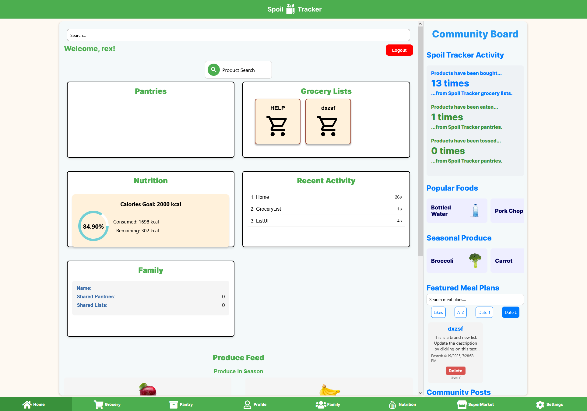
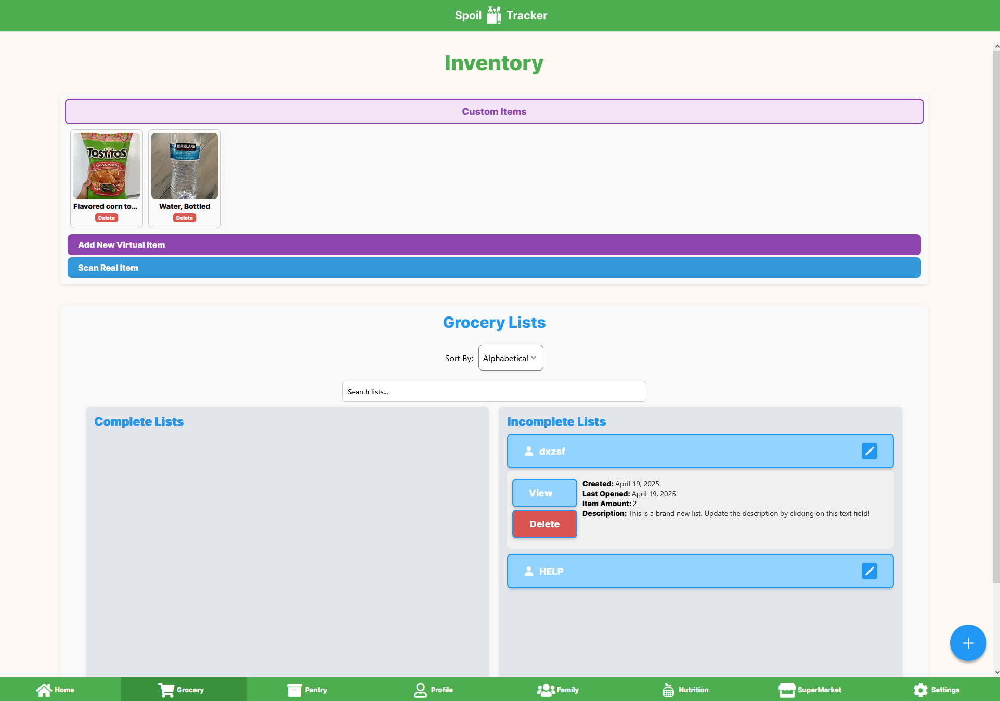
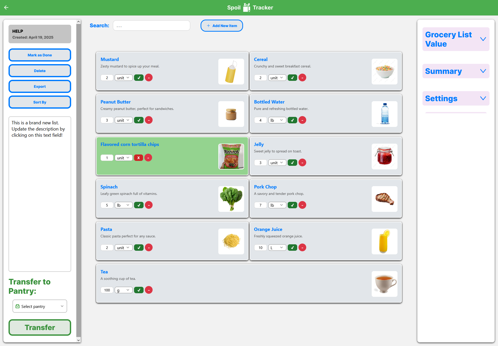
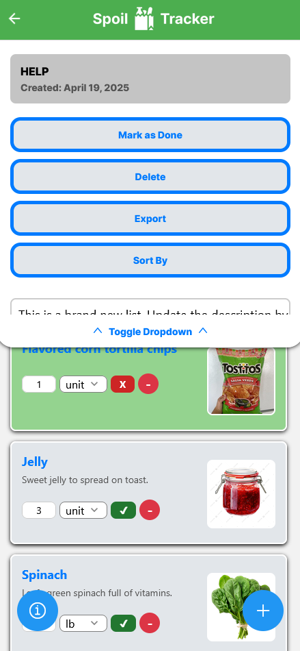

Spoil Tracker is a web and mobile application that helps users keep track of grocery activity and food inventory status. The project is built using React Native + Expo framework, with Apollo GraphQL and Firebase. 

<!-- MANPAGE: BEGIN EXCLUDED SECTION -->
* [INSTALLATION](#installation)
  * [REQUIREMENTS](#requirements)
  * [KEYS](#keys)
  * [APPLICATION SETUP](#application-setup)
* [OVERVIEW](#installation)
  * [USAGE](#usage)
  * [MEDIA](#media)


# Installation

Most of the installation and setup process is streamlined with Expo. There are a couple of credentials needed before installation though, which is described below.

## Requirements

The repository is set up so that you host your own server for your own application and client. With that said, the following is required in order to successfully compile and run the app:
1. Verify that you have [NodeJS and NPM installed on your desktop](https://nodejs.org/en/download)
2. A valid [Firebase project with Firestore Database setup + Service Account Keys.](https://firebase.google.com/)
3. [Food & Drug Administration API Key](https://open.fda.gov/apis/authentication/) (Optional)
4. [OpenAI API Key](https://platform.openai.com/playground) (Optional)

## Keys

In terms of backend functionality, the application runs on Firebase and thus will need valid application credentials and an accompanying service account key to read/write a Firestore database. 

After creating a project in Firebase, [create a web Firebase app and take note of the credentials](https://youtu.be/ILTo8IvFXJw?si=jKLjJtcW9WNKN-vm&t=35) listed under ```firebaseConfig```. You will need this for setup later.

**To obtain service account keys**, after setting up Firestore Database, [generate a new private key with the Firebase Admin SDK.](https://youtu.be/Q6FYoWAWWhI?si=uOQasJTBZpiUxbYg)

**The FDA API key** is used for certain components in the home page to retrieve food and recipe information.

The **OpenAI API key** is used by the application to use GPT to help determine popular and seasonal foods over time, as well as tabulate price costs within grocery lists. 

Not providing a key for either external API will still let you run the application, however the stated features may not work correctly. 

## Application Setup
Copy and paste the contents of your **Firebase service account key** in ```serviceAccountKey.json``` under the services folder in the app directory.

Most of the setup is handled through the ```setup.sh``` bash script. In Git Bash or any other equivalent terminal that can open and use a bash script, open it at the ```spoil-tracker-alpha``` directory and run the script:
```
./setup.sh
```
**NOTE: The script will refuse to run if NodeJS and NPM are not installed on your device.**


It will ask for an FDA API key, an OpenAI API key, and valid firebase app credentials (that go along with your service account key). You may skip on providing the first two API keys, however a select few, small features will be unavailable within the application as a result.

An .env file will generate with the credentials provide. It will also install the necessary dependencies, and run the app locally. The app will continue to run until you forcibly terminate the terminal.

**Important:** Be wary that in some cases the application and server will still run in the background if the terminal has not been properly suspended.

***

# Overview

Spoil Tracker is a web application that aims to keep track of how long the user’s groceries in their fridge and pantry will last before expiring. Spoil Tracker aims to answer the curious questions and solve common inconveniences. By being adaptable to the user’s situation and updates on their fridge or pantry, one will never have to fear having to throw away now-spoiled food that could’ve been avoidable.

The project is under alpha testing and is consequently rough around the edges. The application has been tested through MacOS, Windows, and iOS, but we cannot guarantee full compatibility with other operating systems.

## Usage

The application currently supports the following majors features:
  - Creating and populating a grocery list with custom parameters
  - Creating and populating a virtual pantry with custom parameters
  - Personal profiles
  - Community posting and grocery list sharing w/ commenting
  - Food and recipe lookup
  - Common grocery products browsing
  - Custom item uploading
  - Item barcode scanning and uploading
  - Other small misc. features 

While the application can run on mobile, some areas of the applications have not yet been optimized for mobile use. For now, we recommend using the application with a desktop device.

## Media



